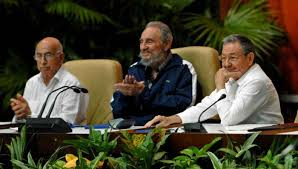
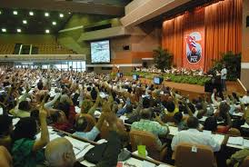

El Sexto Congreso del Partido Comunista de Cuba (PCC), celebrado del 16 al 19 de abril de 2011 en el Palacio de Convenciones de La Habana, representó un momento crucial en la historia reciente de la isla. Este evento fue el primero dirigido formalmente por Raúl Castro tras la salida de Fidel del poder ejecutivo en 2008,

aprobó importantes reformas económicas conocidas como los "Lineamientos". Se trató de 313 medidas destinadas a "actualizar" el modelo socialista, combinando cierto aperturismo económico con el mantenimiento del control estatal. Entre los cambios más significativos destacaron la autorización del trabajo por cuenta propia en 181 actividades, la legalización de la compraventa de viviendas y autos entre particulares (antes prohibida), así como la eliminación de medio millón de empleos estatales y cierta descentralización empresarial.

En el ámbito político, el congreso introdujo algunas modificaciones simbólicas, como la propuesta de límites de mandato (dos períodos de cinco años) y el rejuvenecimiento del Comité Central, cuya edad promedio bajó de 54 a 48 años. Sin embargo, Raúl Castro fue ratificado como Primer Secretario del PCC. Estas decisiones se tomaron en un contexto de severa crisis económica, con Cuba aún afectada por las consecuencias del derrumbe de la URSS.

El legado del 6to Congreso resultó ambivalente: por un lado, sentó las bases para cambios posteriores, como la reforma constitucional de 2019.Al mismo tiempo, el congreso reflejó el complejo equilibrio que Cuba ha buscado entre la actualización de su modelo económico y la preservación de sus principios políticos. Este proceso de transformación gradual continúa siendo una prioridad para el gobierno, que trabaja en adaptar sus políticas a las necesidades actuales mientras mantiene su proyecto socialista.

---

**Fuentes consultadas:**

1. [Página oficial del PCC en el 6to Congreso](https://www.pcc.cu/6to-congreso-del-pcc)
