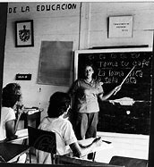
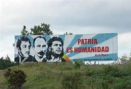
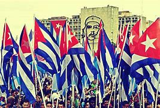

A inicios del siglo XXI, Cuba enfrentó un momento crucial con la **Batalla de Ideas**, una iniciativa impulsada por Fidel Castro para consolidar los valores revolucionarios frente al bloqueo económico y las tensiones geopolíticas. Surgida en el año 2000, esta campaña priorizó la educación, la cultura y la participación popular como herramientas de resistencia. Su lema, **“Un mundo mejor es posible”**, sintetizaba la aspiración de justicia social y soberanía.

El corazón de la Batalla de Ideas fueron los **Programas de la Revolución**, proyectos sociales que transformaron la vida cotidiana. La universalización de la educación superior, las misiones culturales en comunidades rurales y la expansión del acceso a la salud marcaron hitos. Millones de cubanos se beneficiaron, mientras artistas, maestros y médicos se convirtieron en protagonistas de un proyecto colectivo. La campaña también promovió debates públicos sobre ética, antiimperialismo y derechos humanos, vinculando ideología y acción.

La defensa de la identidad nacional fue clave. En respuesta al secuestro del niño Elián González en Estados Unidos (1999-2000), Cuba movilizó a su pueblo en protestas pacíficas, demostrando el poder de la unidad. Este episodio, junto a la creación de canales de televisión educativos y proyectos comunitarios, reforzó el tejido social. La Batalla de Ideas, aunque formalmente concluyó en 2011, dejó un legado de empoderamiento ciudadano y conciencia crítica.

Hoy, aquella etapa se recuerda como un esfuerzo por equilibrar ideales y realidad. Sus programas aún influyen en políticas públicas, y su espíritu resurge en nuevas generaciones que defienden la educación gratuita y la cultura como pilares de la nación. La Batalla de Ideas no fue solo una respuesta a un contexto hostil: fue un recordatorio de que, para Cuba, las ideas son armas de creación masiva.

---

## Fuentes consultadas:

1. [Escandell-Sosa, Vicente E. "La batalla de ideas: fundamento estratégico para el desarrollo de Cuba", Ciencia en su PC, №4, 2007 (Redalyc)](https://www.redalyc.org/pdf/1813/181320170004.pdf)
2. [Rebelión.org: "La Batalla de Ideas: fundamento estratégico para el desarrollo de Cuba"](https://www.rebelion.org/docs/145614.pdf)
3. [EcuRed: Batalla de ideas](https://www.ecured.cu/Batalla_de_ideas)
4. [Fidel Castro y la cultura de lucha y resistencia revolucionaria](http://www.fidelcastro.cu/es/articulos/historia-fidel-revolucion-socialismo-partido-ideologia-pueblo-y-unidad-razones-para)
5. [Periódico ¡ahora!: Siempre en Batalla de Ideas](https://www.ahora.cu/es/opinion/14041-siempre-en-batalla-de-ideas)
