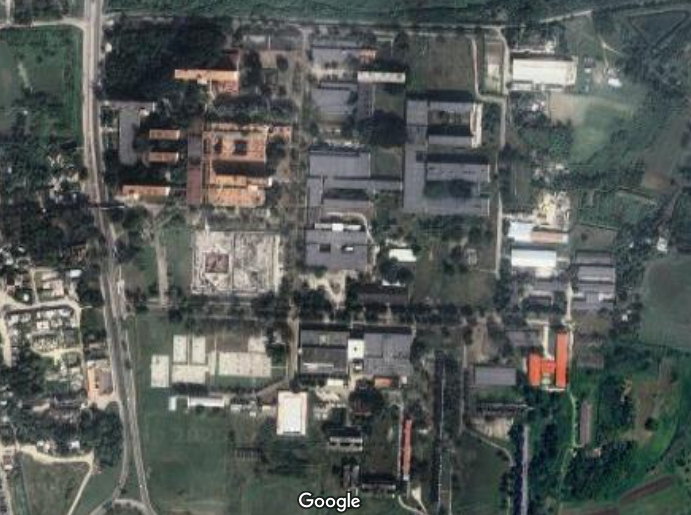

La **Universidad Tecnológica de La Habana “José Antonio Echeverría”**, conocida popularmente como **CUJAE** (por sus antiguas siglas, Ciudad Universitaria José Antonio Echeverría), es la institución rectora en nuestro país en el ámbito de las ciencias técnicas y la arquitectura. Fundada el 2 de diciembre de 1964 por Fidel Castro, la CUJAE se ha consolidado como un centro de excelencia académica y científica, reconocida tanto nacional como internacionalmente.

## Historia y Antecedentes

La CUJAE surge en el contexto de las transformaciones educativas posteriores al triunfo de la Revolución cubana. Sus orígenes se remontan a la antigua Escuela de Ingenieros, Electricistas y Arquitectos de la Universidad de La Habana, creada en 1900. Tras diversas reformas y cambios estructurales, en 1976 se constituyó como Instituto Superior Politécnico y, desde 2016, adoptó su denominación actual como Universidad Tecnológica.

El campus principal se ubica en un extenso terreno cercano al antiguo central azucarero Toledo, en Marianao, La Habana. Su diseño arquitectónico, basado en hormigón armado, destaca por la funcionalidad y belleza de sus edificios, distribuidos en más de cuarenta estructuras que incluyen aulas, laboratorios, bibliotecas, dormitorios, áreas deportivas y centros de investigación.

## Estructura y Facultades

La CUJAE está organizada en nueve facultades, donde se imparten trece carreras vinculadas principalmente a la ingeniería y la arquitectura:

- **Facultad de Arquitectura**
- **Facultad de Ingeniería en Automática y Biomédica**
- **Facultad de Ingeniería Civil**
- **Facultad de Ingeniería Eléctrica**
- **Facultad de Ingeniería Industrial**
- **Facultad de Ingeniería Informática**
- **Facultad de Ingeniería Mecánica**
- **Facultad de Ingeniería Química**
- **Facultad de Ingeniería en Telecomunicaciones y Electrónica**

Además, cuenta con doce centros de investigación, como el Centro de Investigaciones Hidráulicas (CIH) y el Centro de Estudios de Tecnologías Energéticas Renovables (CETER), entre otros.

## Impacto y Reconocimientos

La CUJAE ha graduado a más de cincuenta mil profesionales, incluyendo estudiantes extranjeros de América Latina, África y Asia. Ha desarrollado más de noventa proyectos internacionales y mantiene vínculos académicos con más de doscientas universidades en el mundo. En 2017, fue reconocida con la categoría superior de excelencia por la Junta de Acreditación Nacional, en reconocimiento a sus resultados en formación, investigación e impacto social.

## Infraestructura y Vida Universitaria

El campus de la CUJAE abarca cerca de 398,000 metros cuadrados, con instalaciones modernas que incluyen laboratorios, talleres, bibliotecas, comedores, gimnasios, áreas deportivas y espacios culturales. Esta infraestructura facilita la formación integral de los estudiantes y el desarrollo de actividades científicas y extracurriculares.

## Referencias

1. [Sitio web oficial de la CUJAE](https://www.cujae.edu.cu)
2. [Wikipedia: Universidad Tecnológica de La Habana José Antonio Echeverría](https://es.wikipedia.org/wiki/Universidad_Tecnol%C3%B3gica_de_La_Habana_Jos%C3%A9_Antonio_Echeverr%C3%ADa)
3. [Historia de la CUJAE](https://cujae.edu.cu/universidad/historia-de-la-cujae)
4. [Logo CUJAE](https://seeklogo.com/vector-logo/37399/cujae)
