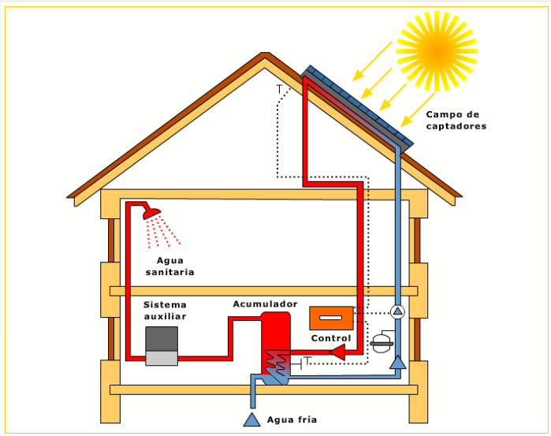
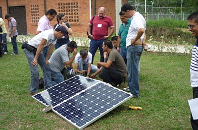
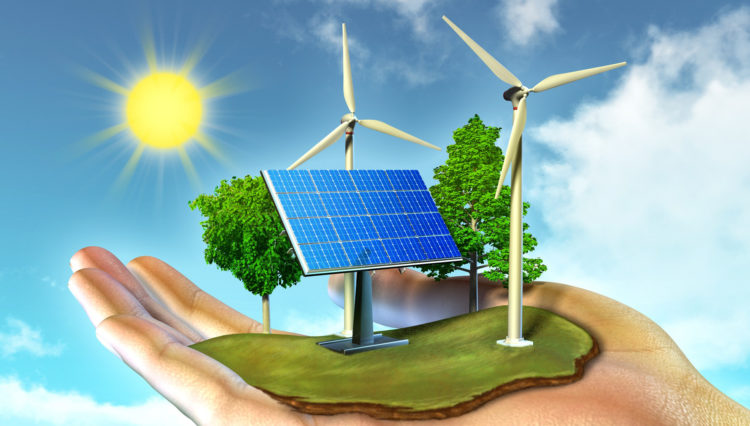

### Durante el período de 2005 a 2014, la CUJAE llevó a cabo varios proyectos de desarrollo sostenible entre los que se destacan:

**Desarrollo de Sistemas Solares Térmicos para Agua Caliente Sanitaria**

Durante esos años, la CUJAE impulsó investigaciones y prototipos de sistemas solares térmicos para la producción de agua caliente en edificios residenciales y públicos. Estos proyectos buscaban reducir el consumo de combustibles fósiles y la dependencia de la electricidad para calefacción, promoviendo el uso de energía limpia y renovable. Se trabajó en el diseño de colectores solares eficientes adaptados a las condiciones climáticas cubanas, con aplicaciones prácticas en la vivienda social.

**Optimización del Consumo Energético en Edificaciones**

La Facultad de Arquitectura y el Departamento de Ingeniería Mecánica desarrollaron proyectos enfocados en la eficiencia energética de edificios, aplicando criterios bioclimáticos y tecnologías de aislamiento térmico para disminuir la demanda energética en climatización. Estos estudios incluían simulaciones térmicas y propuestas de diseño que favorecieran el confort ambiental con menor consumo energético, contribuyendo a la sostenibilidad en la construcción.

**Investigación en Biomasa para Generación de Energía**

La CUJAE participó en proyectos de investigación sobre el aprovechamiento de la biomasa agrícola y forestal como fuente energética alternativa. Estos proyectos buscaban desarrollar tecnologías para la conversión eficiente de residuos orgánicos en energía térmica y eléctrica, apoyando la diversificación energética y la reducción de emisiones contaminantes.

**Formación y Capacitación en Energías Renovables**

Durante este período, la CUJAE fortaleció sus programas académicos y cursos de postgrado en energías renovables y eficiencia energética, formando especialistas capaces de implementar tecnologías limpias en el sector industrial y residencial cubano. Además, se organizaron talleres y seminarios para difundir buenas prácticas y promover la innovación tecnológica en el país.

Estos proyectos reflejan el compromiso de la CUJAE con el desarrollo sostenible, mediante la investigación aplicada y la formación de recursos humanos especializados en energías renovables y eficiencia energética, aspectos clave para la transición energética de Cuba.

**Fuentes consultadas:**

1. [Dimensionado de un sistema térmico solar mediante simulación y su validación energética](http://scielo.sld.cu/scielo.php?script=sci_arttext&pid=S1815-59012013000100006)

2. [Sitio oficial de la Cujae](https://repositorio.cujae.edu.cu/home)
