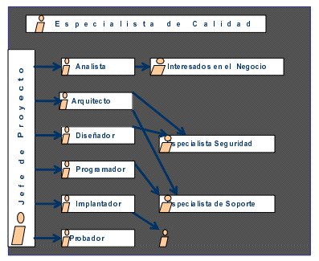
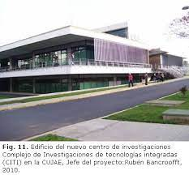
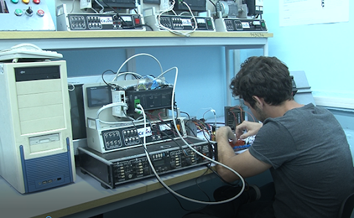

Durante el período de 2005 a 2014, la CUJAE llevó a cabo varios proyectos de desarrollo de software y automatización enfocados en mejorar la eficiencia y calidad de los sistemas informáticos en Cuba. Algunos de los más destacados incluyen:

### Definición de roles en el desarrollo de software

En 2006 se definieron roles clave en el desarrollo de software para mejorar la calidad y productividad en la industria cubana. Algunos de los roles más relevantes fueron:

**Analista de requisitos**: Responsable de recopilar y definir las necesidades del cliente, asegurando que el software cumpla con los objetivos esperados.

**Diseñador de software**: Encargado de estructurar la arquitectura del sistema, estableciendo cómo interactuarán los diferentes componentes.

**Desarrollador o programador**: Implementa el código y las funcionalidades del software, siguiendo las mejores prácticas de programación.

**Tester o evaluador de calidad**: Se dedica a la verificación y validación del software, asegurando que funcione correctamente y cumpla con los estándares de calidad.

**Gestor de proyectos**: Coordina el equipo de desarrollo, supervisa el cumplimiento de plazos y garantiza que el proyecto avance según lo planificado.

### Proyectos de programación y automatización destacados

En 2014 se creó y aplicó un entorno de ingeniería de requisitos para el desarrollo de software en la Cujae. Este entorno, implementado en el Complejo de Investigaciones Tecnológicas Integradas (CITI) de la CUJAE, consistió en un modelo de procesos, métodos y herramientas para gestionar los requisitos de software, con el objetivo de mejorar la calidad y éxito de los proyectos desarrollados en la universidad. Incluyó un flujo de trabajo con seis subprocesos, plantillas, guías y listas de chequeo para facilitar la gestión y evaluación de requisitos, alineándose con estándares internacionales como CMMI. Este proyecto permitió crear conciencia en los equipos de desarrollo sobre la importancia de una correcta ingeniería de requisitos y mejoró la gestión de proyectos en el contexto universitario.

En el período 2005-2014 se desarrollaron proyectos relacionados con la automatización y el control, enmarcados en la evolución histórica de la Ingeniería en Automática en Cuba. Aunque la especialidad tiene raíces desde los años 60, en esos años la universidad continuó fortaleciendo la formación y el desarrollo de sistemas de control automático y automatización industrial, apoyados en la modelación, instrumentación y software para procesos industriales.
Un ejemplo concreto de proyectos de automatización en ese período es el desarrollo de sistemas de adquisición de datos y control para procesos industriales, que incluían la integración de microprocesadores y software para la supervisión y control de plantas productivas, como las industrias del níquel y azucareras. Estos proyectos buscaban optimizar procesos mediante la implementación de sistemas automatizados de gestión y control, mejorando la eficiencia y reduciendo costos operativos.

---

**Fuentes consultadas:**

1. [ROLES EN EL PROCESO DE DESARROLLO DE SOFTWARE PARA LAS EMPRESAS CUBANAS](https://www.redalyc.org/pdf/3604/360433560012.pdf)

2. [Entorno de ingeniería de requisitos aplicado para producir software en una universidad](http://scielo.sld.cu/scielo.php?script=sci_arttext&pid=S1815-59362014000100006)

3. [Sitio web oficial de la Cujae](https://www.cujae.edu.cu)
