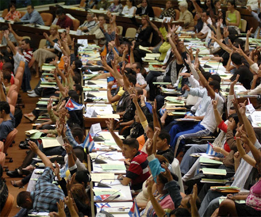
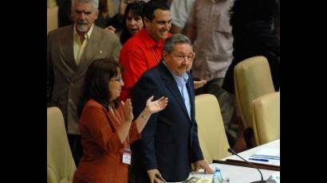
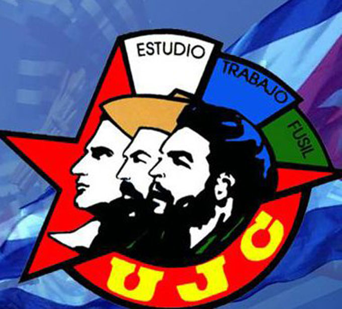

El presidente Raúl Castro convocó a numerosos delegados de la Unión de Jóvenes Comunistas (UJC) a convertir la "batalla económica" en prioridad ideológica. El discurso marcó el tono del IX Congreso, celebrado el 5 de abril de 2010 en el Palacio de las Convenciones de La Habana, donde se abordó la emigración masiva y salarios equivalentes a 20 USD mensuales.

### Crisis económica y autocrítica

Bajo el lema _"No habrá relevo, sino continuidad"_, Castro reconoció que el Partido Comunista comparte responsabilidad en problemas estructurales como burocracia y mala implementación de los mecanismos administrativos y económicos. "Enseñaremos a respetar los bienes, enseñándolos a crear", citó del histórico discurso de Fidel Castro en 1972, mientras delegados de 28 años promedio -muchos formados durante el Periodo Especial- aplaudían.

Raúl señaló que al igual que todos los pueblos del Tercer Mundo,Cuba es víctima del robo descarado de cerebros y fuerza de trabajo joven,y que no se puede cooperar jamás con ese saqueo de nuestros recursos humanos. Además hizo énfasis en que la educación de los cuadros será la tarea más importante para el Partido y expresó:"No habrá jamás soluciones fáciles, el rigor y la exigencia tendrán que prevalecer"

**Cifras clave**:

- 1000 delegados participaron en el congreso (datos de Cubadebate)
- 64% de los alimentos se importaban en 2010 (datos de la ONEI)

### Declaraciones destacadas

> "El espíritu autocrítico, la incesante necesidad de estudiar, observar y reflexionar, son a mi juicio características de las que no puede prescindir ningún cuadro revolucionario."  
> _— Raúl Castro, presidente de Cuba (2010)_

### Contexto internacional

El evento coincidió con:

1. Presión de la UE por derechos humanos
2. Inicio de las reformas económicas de Raúl Castro
3. Apertura de negocios privados (178 oficios autorizados en 2010)

---

**Fuentes consultadas:**

1. [El 9no Congreso de la Unión de Jóvenes Comunistas(Cubadebate)](http://www.cubadebate.cu/reflexiones-fidel/2010/04/08/el-ix-congreso-de-la-union-de-jovenes-comunistas-de-cuba/)
2. [Discurso pronunciado por el General de Ejército Raúl Castro Ruz, en la clausura del IX Congreso de la UJC](http://www.fidelcastro.cu/es/noticia/discurso-pronunciado-por-el-general-de-ejercito-raul-castro-ruz-en-la-clausura-del-ix)
3. [Noveno Congreso de la UJC: Un debate revolucionario y abierto](https://www.juventudrebelde.cu/index.php/cuba/2010-03-27/noveno-congreso-de-la-ujc-un-debate-revolucionario-y-abierto)
