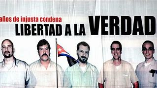
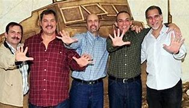
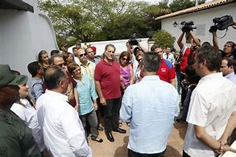

## Una lucha internacional por la justicia

En 1998, los cubanos **Gerardo Hernández, Ramón Labañino, Antonio Guerrero, Fernando González y René González** fueron arrestados en Miami y condenados a largas penas de prisión bajo acusaciones de espionaje. Para Cuba, eran agentes que infiltraban grupos terroristas anticubanos en Florida, protegiendo a su país de ataques como los de 1997 en hoteles de La Habana. Su caso movilizó a organizaciones y gobiernos de todo el mundo, que denunciaron irregularidades en el juicio y exigieron su libertad durante 16 años.

## El día que cambió la historia

El **17 de diciembre de 2014**, tras negociaciones secretas entre Cuba y Estados Unidos, se anunció la liberación de los tres héroes que aún permanecían en prisión (Gerardo, Ramón y Antonio). Su regreso a la isla fue una explosión de júbilo: miles de personas inundaron las calles para recibirlos, mientras la prensa transmitía en vivo los abrazos con sus familias y las lágrimas de Fidel Castro durante su discurso de bienvenida.

## Legado de unidad y dignidad

El regreso no solo cerró un capítulo de dolor, sino que reforzó el discurso de resistencia frente al bloqueo económico. Hoy, Los Cinco son símbolos de lealtad: sus nombres aparecen en escuelas, murales y canciones. Su historia se enseña como ejemplo de sacrificio colectivo y diplomacia persistente.

---

**Fuentes consultadas**:

1. [Granma: "La verdad sobre los Cinco"](http://www.granma.cu/cinco-heroes)
2. [Cubadebate: Crónica del regreso](https://www.cubadebate.cu/especiales/2014/12/17/)
3. [Resumen Latinoamericano: La campaña internacional](https://www.resumenlatinoamericano.org/)
