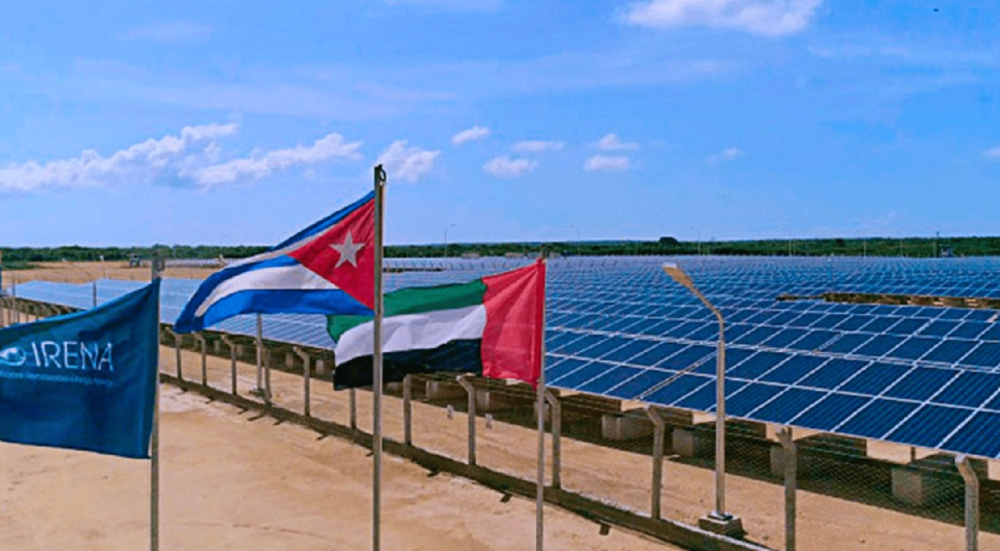

En 2006, Cuba lanzó la llamada "Revolución Energética", un ambicioso programa para modernizar su sistema eléctrico, reducir el consumo de energía y disminuir la dependencia de combustibles fósiles. Este plan surgió en un contexto de crisis energética, con frecuentes apagones y una infraestructura obsoleta.

## Causas de la Revolución Energética

- **Apagones masivos**: Especialmente críticos en el período 2004-2005.
- **Infraestructura envejecida**: Red eléctrica con altos niveles de deterioro.
- **Dependencia del petróleo venezolano**: Basado en el acuerdo de Petrocaribe.
- **Robo y desperdicio energético**: Uso ilegal de conexiones ("diablitos") y equipos ineficientes.
- **Necesidad de eficiencia**: Reducción de costos y optimización del sistema.

## Medidas Implementadas

- **Sustitución de bombillas**: Cambio masivo a luces LED (80-90% de ahorro en iluminación).
- **Electrodomésticos eficientes**: Distribución de neveras, ventiladores y cocinas de bajo consumo.
- **Generadores descentralizados**: Pequeñas plantas locales para evitar colapsos en la red nacional.
- **Combate al robo eléctrico**:
  - Fiscalización de conexiones ilegales.
  - Instalación de medidores en hogares.
- **Energías renovables**: Pequeños proyectos solares y eólicos (impacto limitado inicial).

## Resultados

- **Reducción de apagones**: Mayor estabilidad en el suministro eléctrico.
- **Ahorro energético**: Consumo reducido en un 20-30% en los primeros años.
- **Concientización ciudadana**: Cultura de ahorro promovida por el Estado.

## Legado

La Revolución Energética fue un **éxito parcial**: resolvió problemas urgentes pero no transformó la matriz energética a largo plazo. Sentó bases para políticas futuras de eficiencia y energías renovables, retomadas en la década de 2010.

---

**Fuentes consultadas**:

1. ["Revolución Energética en Cuba", _EcuRed_.](https://www.ecured.cu/Revoluci%C3%B3n_Energ%C3%A9tica_en_Cuba)
2. ["Cuba: Revolución Energética", _Crisis Energética_, 25 dic. 2005.](https://www.crisisenergetica.org/article.php?story=20051225141716519)
3. [A. Fernández, "La revolución energética cubana en la UCLV: Análisis de los impactos sociales", _Academia.edu_.](https://www.academia.edu/123596384/La_revoluci%C3%B3n_energ%C3%A9tica_cubana_en_la_UCLV_An%C3%A1lisis_de_los_impactos_sociales)
