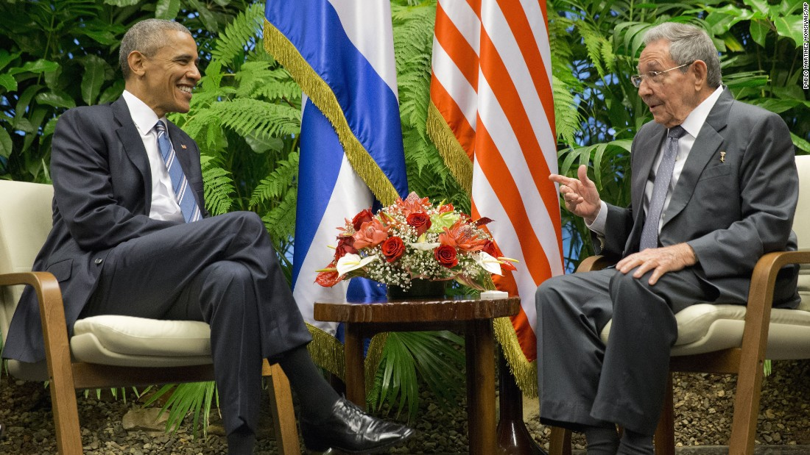

La visita del presidente estadounidense Barack Obama a Cuba del 20 al 22 de marzo de 2016 marcó un hecho histórico, siendo la primera vez en 88 años que un mandatario estadounidense en ejercicio pisaba la isla. Este viaje fue parte del proceso de acercamiento diplomático iniciado en 2014, que buscaba normalizar las relaciones tras décadas de tensión.

## Contexto

En diciembre de 2014, Obama y el entonces presidente cubano Raúl Castro anunciaron el restablecimiento de relaciones, lo que incluyó la reapertura de embajadas en 2015. La visita de Obama en 2016 buscaba consolidar este acercamiento, promoviendo el diálogo en temas económicos y políticos, aunque sin levantar el embargo (que depende del Congreso de EE.UU.).

## Eventos Clave

- **Reunión con Raúl Castro**: Abordaron cooperación económica y derechos humanos, sin avances concretos.

- **Discurso en el Gran Teatro de La Habana**: Obama habló de democracia y reconciliación, dirigido directamente al pueblo cubano.
- **Encuentros con la sociedad civil**: Se reunió con emprendedores privados, aunque críticos señalaron que evitó a figuras opositoras más prominentes.
- **Partido de béisbol Tampa Bay Rays vs. Cuba**: Un gesto simbólico de intercambio cultural.

## Impacto y Críticas

- **Símbolo de apertura**: La visita reforzó la diplomacia de Obama, pero sin cambios estructurales en Cuba.
- **Críticas**: Sectores republicanos en EE.UU. la tacharon de "concesión" al régimen, mientras que, en Cuba, el gobierno la usó para mostrar su resistencia ante EE.UU.

## Conclusión

El acercamiento impulsado por Obama se estancó con la llegada de Donald Trump en 2017, quien reinstauró sanciones y adoptó un discurso más confrontacional. Sin embargo, la visita de 2016 quedó como un referente de diplomacia pragmática, demostrando que el diálogo es posible incluso entre adversarios históricos.

Aunque los resultados tangibles fueron limitados, el viaje rompió barreras psicológicas y dejó una huella en la memoria colectiva de ambos países, abriendo una ventana de oportunidad que, en otro contexto político, podría haber llevado a una relación más estable y cooperativa.

---

**Fuentes consultadas**:

1. https://oncubanews.com/especiales/obama-en-cuba-antes-durante-y-despues/
